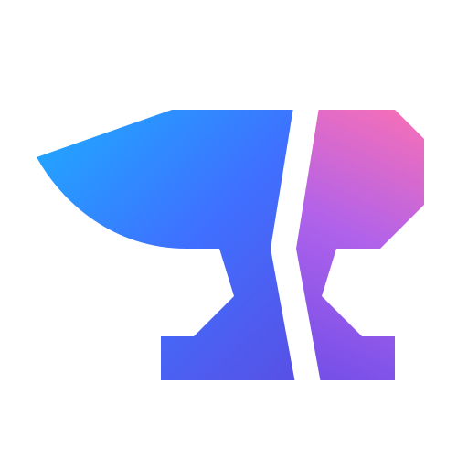

# castia



Idiomatic SDKs for [Microsoft Foundry](https://ai.azure.com) hosted agents.

`castia` lets a hosted agent speak Foundry's three wire protocols — Activity
(Teams/Bot Framework), OpenAI `responses`, and `invocations` — through
protocol-named decorators, dependency injection, and typed builders for
messages, Adaptive Cards, entities, and invoke envelopes.

This is a **polyglot monorepo**: one framework, multiple language SDKs that all
implement the same protocols and are verified against a shared conformance spec.

Using the Python package from another agent? Start with the
[consumer agent guide](packages/python/AGENTS.md). It includes uv installation,
a complete Responses agent with native MCP tools, offline tests, and the
approval boundaries for live work. The [Python README](packages/python/README.md)
and [lifecycle guide](packages/python/LIFECYCLE.md) cover the detailed APIs.

For Copilot App setup, see the [scenario repo starter](docs/copilot-app.md).
The scenario repo is where a specific demo should live; this repo keeps the
reusable SDK, specs, and Copilot extras.

## Layout

```
castia/
├─ examples/
│  ├─ python/         # checked-in lifecycle examples for agent/plugin validation
│  └─ rust/           # checked-in smoke examples for Rust parity work
├─ spec/              # source of truth: protocol contracts + conformance fixtures
└─ packages/
   ├─ python/         # the Python SDK (PyPI: castia)
   │  └─ AGENTS.md    # consumer guide for agents using the Python SDK
   └─ rust/           # experimental Rust SDK/runtime crate
```

| SDK | Path | Registry | Status |
| --- | --- | --- | --- |
| Python | [`packages/python`](packages/python) | [PyPI `castia`](https://pypi.org/project/castia/) | alpha |
| Rust | [`packages/rust`](packages/rust) | crates.io `castia` | experimental, unpublished |

Each SDK owns its native toolchain, lockfile, and release cadence. Versions and
release tags are **per language** (e.g. `python-v0.1.0`), not repo-wide.

Within the Python SDK, implementation code is grouped by capability, from
protocols and hosting through evaluation and delivery. The
[package map](packages/python/README.md#package-organization) lists the owners.
The short public API remains unchanged; lower-level imports use the capability
paths.

The [spec guide](spec/README.md) separates shared data and behavior from runtime
adapters. Typra emits Rust contract traits, models, and conformance tests from
TypeSpec. The Rust package is still experimental, but it now implements the
portable behavior seams covered by those vectors plus a hosted deployment smoke.
The Python runtime remains the shipped SDK and source of proven production
ergonomics.

## Contributing

Work inside the package you're changing (`packages/<lang>`). Cross-language
behavior is anchored by [`spec/`](spec) — new protocol behavior lands as a spec
fixture first, then each SDK implements against it.

Commits and PR titles follow [Conventional Commits](https://www.conventionalcommits.org/);
releases are automated per language by release-please. See
[`CONTRIBUTING.md`](CONTRIBUTING.md) for the commit convention and release flow,
and [`packages/python/RELEASING.md`](packages/python/RELEASING.md) for the Python
publish setup.

## License

MIT © 2026 Seth Juarez
